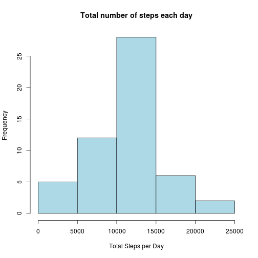
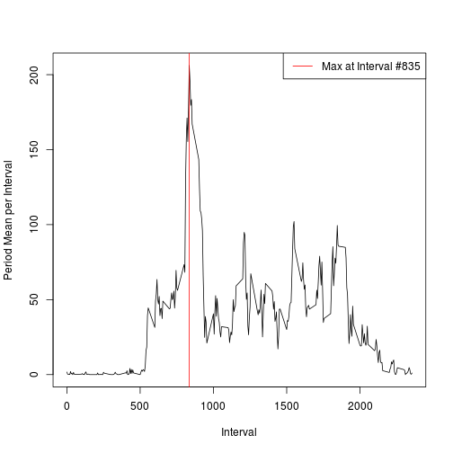
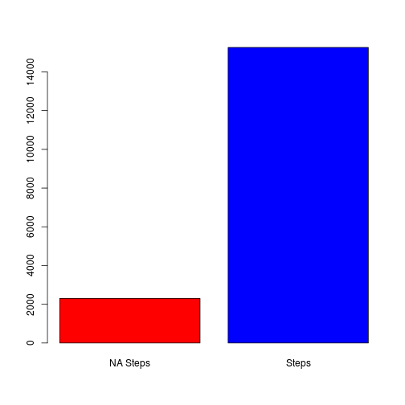
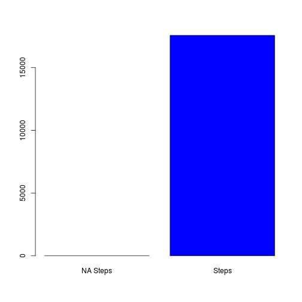
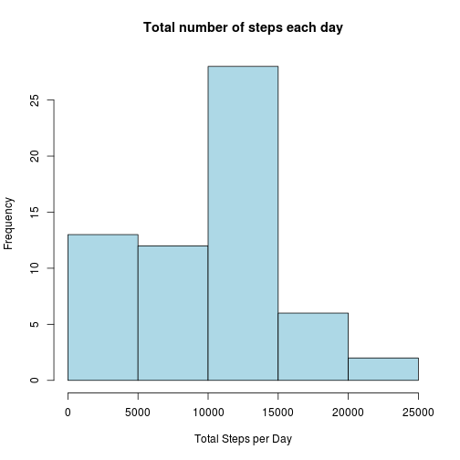
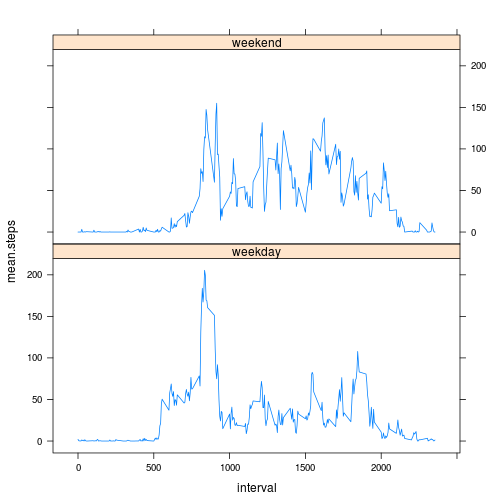

## Loading and Preprocessing the data
In this section we are preprocessing the repository zip file to load it for analysis.


```r
library(dplyr,quietly=TRUE,warn.conflicts=FALSE)
unzip("./activity.zip")
df <- tbl_df(read.csv("activity.csv",
               colClasses=c("numeric","Date","numeric"),
               stringsAsFactors=FALSE))

head(df)
```

```
## Source: local data frame [6 x 3]
## 
##   steps       date interval
## 1    NA 2012-10-01        0
## 2    NA 2012-10-01        5
## 3    NA 2012-10-01       10
## 4    NA 2012-10-01       15
## 5    NA 2012-10-01       20
## 6    NA 2012-10-01       25
```

## What is mean total number of steps taken per day?
### Total steps per day

```r
s <- summarize(group_by(df,date), total.steps=sum(steps))
head(s)
```

```
## Source: local data frame [6 x 2]
## 
##         date total.steps
## 1 2012-10-01          NA
## 2 2012-10-02         126
## 3 2012-10-03       11352
## 4 2012-10-04       12116
## 5 2012-10-05       13294
## 6 2012-10-06       15420
```

### Total steps per day (histogram)

```r
hist(s$total.steps, xlab="Total Steps per Day",col="lightblue",main="Total number of steps each day")
```

 

### Mean and Median

```r
mean(s$total.steps,na.rm=TRUE)
```

```
## [1] 10766.19
```

```r
median(s$total.steps,na.rm=TRUE)
```

```
## [1] 10765
```


## What is the average daily activity pattern?


```r
s <- summarize(group_by(df,interval), meansteps=mean(steps,na.rm=TRUE))
heighest.interval <- s[s$meansteps==max(s$meansteps),]$interval
heighest.interval
```

```
## [1] 835
```

```r
plot(s$interval,s$meansteps,type='l',xlab="Interval",ylab="Period Mean per Interval")
abline(v=heighest.interval,col="red")
legend("topright",legend=c(paste0("Max at Interval #",heighest.interval)),col=c("red"),lty=c(1))
```

 


## Imputing missing values

### Calculate Missing Values
The barplot shows the number of NAs within the original dataset.

```r
sum(is.na(df$steps))
```

```
## [1] 2304
```

```r
barplot( c( "NA Steps"=sum(is.na(df$steps)), Steps=sum(!is.na(df$steps))) , col = c("red","blue"))
```

 

### Tidy Data Strategy
We will replace NAs in an interval by the median for that interval across all days.

### Clean up
The code implements the policy described in the previous section. The barplot provides a comparison of NA counts (it now shows 0).

```r
s <- summarize(group_by(df,interval), mediansteps=median(steps,na.rm=TRUE))
m <- merge(df,s,by="interval")
f <- mutate(m,cleaned.steps=ifelse(is.na(steps),mediansteps,steps))
df <- select(f,-steps,-mediansteps) %>% rename(steps=cleaned.steps) 
barplot( c( "NA Steps"=sum(is.na(df$steps)), Steps=sum(!is.na(df$steps))) , col = c("red","blue"))
```

 


### Total steps per day (w/ tidy data)
This is now the same histogram as in the previous section but with NAs replaced by Medians.

```r
s <- summarize(group_by(df,date), total.steps=sum(steps))
hist(s$total.steps, xlab="Total Steps per Day",col="lightblue",main="Total number of steps each day")
```

 

### Mean and Median

```r
mean(s$total.steps)
```

```
## [1] 9503.869
```

```r
median(s$total.steps)
```

```
## [1] 10395
```

## Are there differences in activity patterns between weekday and weekends?
First we will, as required, add a column with a weekday/weekend factor. Then we will plot some funky stuff out of that.

### Add [weekday] vs [weekend] factor

```r
library(lattice)
weekend <- function(d) { 
  w <- weekdays(as.Date(as.character(d)),abbreviate=TRUE)  
  ifelse (w %in% c("Sat","Sun"), "weekend","weekday") 
}
f <- select(f,-steps,-mediansteps) %>% rename(steps=cleaned.steps)
df <- mutate(f,Day=weekend(date))
df$Day <- as.factor(df$Day)
df_s <- summarize(group_by(df,Day,interval),mean.steps=mean(steps))
xyplot(mean.steps~interval|Day,data=df_s,layout=c(1,2),type="l")
```

 
